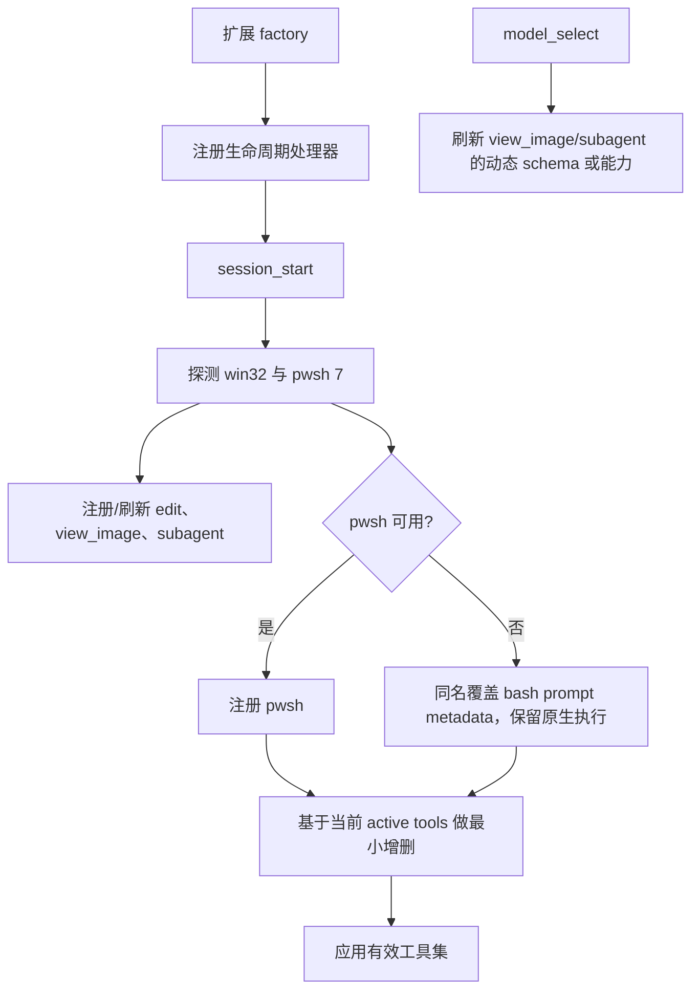

# 技术架构草案

## 交付形态

建议 package 仅声明一个扩展入口：

```text
pi-enhanced/
├── extensions/
│   ├── pi-enhanced.ts       # 唯一公开、自动加载的扩展入口
│   └── lib/                 # 不被 pi 自动发现的内部实现
│       ├── activation.ts
│       ├── pwsh.ts
│       ├── edit.ts
│       ├── view-image.ts
│       ├── subagent.ts
│       └── settings.ts
├── tests/
├── package.json
└── tsconfig.json
```

“单入口”由 package manifest 保证；不要求把所有逻辑塞入一个物理文件。这样能保持发布表面极简，同时让每个高风险工具可独立测试。

## 启动与刷新流程



关键约束：

- 平台探测必须真实执行 `pwsh -NoProfile -NonInteractive -Command` 验证 major version ≥ 7；只发现文件不等于可运行。
- 探测结果可在扩展实例内缓存，session reload 时重新构造实例即可。
- `setActiveTools()` 以 `pi.getActiveTools()` 为基础做集合变换：删除本扩展明确接管的工具，保留未知工具。
- 注册同名 `edit` 覆盖执行；active tools 中仍使用名字 `edit`。
- `pwsh` 使用新名字，因此必须先注册，再把 `pwsh` 加入 active tools 并移除 `bash`。
- `view_image`、`subagent` 先注册后激活；避免传入未知工具名被 pi 忽略。
- `view_image` 在 `session_start` / `model_select` 按当前模型的 image input 能力重新注册 prompt metadata：多模态路径描述为当前模型亲自查看图片，纯文本路径明确说明会委托外挂 vision 模型并返回其描述。

## 复用边界

### 优先直接复用 pi

- shell：`createBashTool()` 或其 definition 对应构造器，保留输出聚合、50 KB / 2,000 行截断、timeout、取消、进程树终止和 TUI。
- edit：复用 pi 导出的队列、路径、diff 与 renderer 能力；若部分成功算法所需函数未导出，再复制带来源注释的最小纯函数。
- image：复用 pi 原生 read/image resize 路径或可导出的 image helpers，不重新实现图片格式解析。
- subagent：使用 pi SDK 创建内存子 session，不通过启动子 CLI 进程模拟。

### 允许本地实现

- PowerShell 7 探测与 prompt guidance。
- edit 的逐项分类、冲突消解和结果格式化。
- vision fallback 的模型选择、stream 状态归约和 UI renderer。
- 顶层配置合并与校验。
- subagent 针对增强工具面的绑定逻辑。

## 工具激活协调器

入口不应让每个模块分别调用 `setActiveTools()`，否则注册顺序会造成互相覆盖。建议由 `activation.ts` 集中计算：

1. 读取当前 active names。
2. 始终以增强 `edit` 接管 `edit` 名字（集合中名字不变）。
3. 始终移除 `read`。
4. 若 pwsh 可用，移除 `bash`、加入 `pwsh`；否则同名注册带增强 guidance 的 `bash` override、移除可能残留的 `pwsh` 并保留原先 `bash` 状态。
5. 加入 `view_image` 与 `subagent`。
6. 去重后一次调用 `setActiveTools()`。

注意：“保留原先 `bash` 状态”意味着如果用户本来手动禁用了 bash，扩展不应擅自启用它。

## 并发与原子性

- `edit` 对同一绝对路径使用 `withFileMutationQueue()` 串行化完整的 read-classify-write 周期。
- accepted edits 基于同一个原始快照匹配，并在一次 write 中提交，避免逐项写盘导致后续匹配依赖前项。
- 同一调用中的重叠 edit 不可同时应用；冲突策略见工具契约。
- vision 与 subagent 都接受父 `AbortSignal`，并在 `finally` 中停止 timer、unsubscribe、abort/shutdown/dispose。
- subagent 可声明 `executionMode: "parallel"`，但不得共享可变的 per-call tracker。

## 子 session 组装

子 agent 使用 `createAgentSession()` 和内存 `SessionManager`。为避免公开入口递归注册 `subagent`，child resource loader 禁用常规扩展发现，再加载一个隐藏 inline extension：

- 按当前平台注册 `pwsh` 或增强提示词的原生 `bash`；
- 启用原生 `write`，注册增强 `edit` 与动态 `view_image`；
- 始终移除 `read` 与 `subagent`；
- 继承主调用选择的 peer/advisor 模型、thinking level、cwd 和 project trust。

这样复用同一组工具工厂，同时从结构上阻止递归 delegation。

## 兼容性原则

- 对 pi 的非公开实现复制必须记录上游文件与基线版本。
- 对公开构造器的返回 shape 做最小 wrapper，不假定未声明字段永久存在。
- 升级 pi 时重点回归：工具 details shape、renderer 继承、extension lifecycle、SettingsManager、nested usage 与 model stream event。
