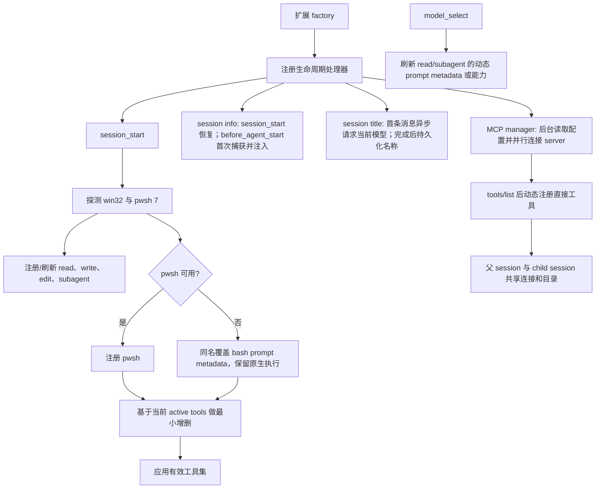

# 技术架构

## 交付形态

package 仅声明一个扩展入口：

```text
pi-enhanced/
├── extensions/
│   ├── pi-enhanced.ts       # 唯一公开、自动加载的扩展入口
│   └── lib/                 # 不被 pi 自动发现的内部实现
│       ├── activation.ts
│       ├── pwsh.ts
│       ├── edit.ts
│       ├── read.ts
│       ├── write.ts
│       ├── subagent.ts
│       ├── session-info.ts
│       ├── session-title.ts
│       └── settings.ts
├── tests/
├── docs/
├── package.json
└── tsconfig.json
```

“单入口”由 package manifest 保证；不要求把所有逻辑塞入一个物理文件。这样能保持发布表面极简，同时让每个高风险工具可独立测试。

## 启动与刷新流程



关键约束：

- 平台探测沿用 `pi-extensions` 的轻量策略：只在 `PATH` 与常见 PowerShell 7 安装位置查找 `pwsh.exe`，不为版本检查启动子进程。
- 探测结果可在扩展实例内缓存，session reload 时重新构造实例即可。
- `setActiveTools()` 以 `pi.getActiveTools()` 为基础做集合变换：删除本扩展明确接管的工具，保留未知工具。
- 注册同名 `edit` 覆盖执行；active tools 中仍使用名字 `edit`。
- 注册同名 `write` 覆盖执行；复用原生 definition 并只注入兼容 Bun/Windows `EEXIST` 的本地 operations。官方 pi 或 Bun 修复后删除该临时覆盖。
- `pwsh` 使用新名字，因此必须先注册，再把 `pwsh` 加入 active tools 并移除 `bash`。
- `read`、`subagent` 先注册后激活；`read` 以同名 definition 覆盖原生工具，但复用原生 execute/render 能力。
- `read` 在 `session_start` / `model_select` 按当前模型的 image input 能力重新注册 prompt metadata：多模态路径描述为当前模型亲自查看图片，纯文本路径明确说明会委托外挂 vision 模型并返回其描述。
- session info 在第一轮 `before_agent_start` 才同时捕获时间与当前模型，并写入 `session-info` custom entry；后续轮次、模型切换和 session resume 始终复用固定 prompt。
- session title 只处理没有历史用户消息、没有现有名称的新会话。第一轮 `before_agent_start` 立即启动不阻塞主回答的当前模型请求。请求不设置模型输出 token 上限；prompt 要求中文与英文单词混排时保留一个空格，标题长度由 prompt 和返回后的 60 字符清洗共同约束，不对中英文边界做代码改写。完成后通过 `setSessionName()` 持久化，请求失败或纯图片首条消息静默保留 pi 默认名称。
- fork 不调用标题模型：若继承到名称，则把末尾 ` (n)` 递增，或首次追加 ` (1)`；未命名 fork 保留 pi 默认名称。
- MCP manager 在 `session_start` 立即开始异步读取配置和连接，不等待 `before_agent_start`，因此不人为延迟首轮。每个 server 完成 `tools/list` 后批量刷新工具面；`tools/list_changed` 使用 SDK 的聚合结果继续刷新。`session_shutdown` 关闭 manager 与 transport。

## 复用边界

### 优先直接复用 pi

- shell：`createBashTool()` 或其 definition 对应构造器，保留输出聚合、50 KB / 2,000 行截断、timeout、取消、进程树终止和 TUI。
- edit：复用 pi 导出的队列、路径、diff 与原生 self-rendered call renderer；result renderer 先委托原生逻辑回填实际 diff，再追加部分成功的折叠/展开警告。若部分成功算法所需函数未导出，再复制带来源注释的最小纯函数。
- write：复用 `createWriteToolDefinition()` 的完整 contract，只注入本地 `mkdir` / `writeFile` operations；`EEXIST` 仅在 `stat` 确认父路径为目录后忽略。
- image：复用 pi 原生 read/image resize 路径或可导出的 image helpers，不重新实现图片格式解析。
- subagent：使用 pi SDK 创建内存子 session，不通过启动子 CLI 进程模拟。
- MCP：使用官方 TypeScript SDK 的 client、stdio transport 与 Streamable HTTP transport，不自行实现协议握手、分页、取消或 session transport。

### 允许本地实现

- PowerShell 7 探测与 prompt guidance。
- edit 的逐项分类、冲突消解和结果格式化。
- vision fallback 的模型选择、stream 状态归约和 UI renderer。
- 顶层配置合并与校验。
- subagent 针对增强工具面的绑定逻辑。
- 两层 MCP 配置读取、严格校验、覆盖合并、工具命名以及 MCP content 到 pi tool result 的适配。

## 工具激活协调器

入口不让每个模块分别调用 `setActiveTools()`，否则注册顺序会造成互相覆盖。由 `activation.ts` 集中计算：

1. 读取当前 active names。
2. 始终以增强 `edit` 接管 `edit` 名字（集合中名字不变）。
3. 始终加入同名覆盖后的 `read` 与 `write`。
4. 若 pwsh 可用，移除 `bash`、加入 `pwsh`；否则同名注册仅带通用 shell/ripgrep guidance 的 `bash` override、移除可能残留的 `pwsh` 并保留原先 `bash` 状态。
5. 加入 `subagent`。
6. 去重后一次调用 `setActiveTools()`。

注意：“保留原先 `bash` 状态”意味着如果用户本来手动禁用了 bash，扩展不应擅自启用它。

## 并发与原子性

- `edit` 对同一绝对路径使用 `withFileMutationQueue()` 串行化完整的 read-classify-write 周期。
- `write` 继续使用原生 definition 内的 mutation queue；增强层不改变并发边界。
- accepted edits 基于同一个原始快照匹配，并在一次 write 中提交，避免逐项写盘导致后续匹配依赖前项。
- 同一调用中的重叠 edit 不可同时应用；冲突策略见工具契约。
- vision 与 subagent 都接受父 `AbortSignal`，并在 `finally` 中停止 timer、unsubscribe、abort/shutdown/dispose。
- session title 请求同时绑定当前 agent signal 与 session-scoped abort controller；session shutdown、reload 或切换时取消，异步结果写入前再次核对 session id 和当前名称，避免覆盖手工 `/name` 或串写新会话。
- subagent 可声明 `executionMode: "parallel"`，但不得共享可变的 per-call tracker。

## 子 session 组装

子 agent 使用 `createAgentSession()` 和内存 `SessionManager`。为避免公开入口递归注册 `subagent`，child resource loader 禁用常规扩展发现，再加载一个隐藏 inline extension：

- 按当前平台注册 `pwsh` 或增强提示词的原生 `bash`；
- 注册增强 `write`、增强 `edit` 与动态 `read`；
- 始终移除 `subagent`，但保留同名覆盖后的 `read`；
- 订阅父 session 的 MCP manager，注册当前及后续发现的 MCP 直接工具；只借用连接，不拥有或关闭 transport；
- 继承主调用选择的 peer/advisor 模型、thinking level、cwd 和 project trust。

这样复用同一组工具工厂，同时从结构上阻止递归 delegation。

## MCP 生命周期与工具面

- manager 由父 session 独占，配置在 session 启动时读取一次；全局与可信项目配置按 server 名覆盖合并。
- 各 server 并行连接，因此快 server 不等待慢 server。目录按照 server 名和原始 tool 名排序，减少无意义的工具顺序变化。
- MCP 原始 JSON Schema 直接交给 pi；pi 对 raw JSON Schema 做参数校验并在 provider adapter 层处理兼容，不在本扩展构造另一套通用 schema 转换器。
- 工具不提供 `promptSnippet` / `promptGuidelines`，信息只放在 tool name、label、description 与 parameters 中，避免重复修改 system prompt。
- 工具删除时从 active set 移除；由于 Pi 没有 unregister API，旧 definition 可留在 registry，但不会再发送给模型。新增或变更工具从下一次模型请求起生效。
- 调用通过同一 SDK client 路由回原 server，透传 `AbortSignal`。文本与图片原样转成 Pi content；resource 转成有来源标记的文本，audio/binary resource 返回有界的类型说明。
- 所有 text/resource/structured-only 文本块先合并成一个预算域，再按 Pi 原生上限保留 head：50 KB 或 2,000 行，任一先到即截断。超长单行使用 UTF-8 安全的字节前缀，完整文本以 `0600` 写入系统临时目录；image blocks 不占文本预算并继续传递。
- TUI renderer 与模型输出保护相互独立：collapsed 只渲染来源标识和最多 3 行/约 800 源字符，`Ctrl+O` 展开后显示已经过模型侧保护的完整结果。

## 兼容性原则

- 对 pi 的非公开实现复制必须记录上游文件与基线版本。
- 对公开构造器的返回 shape 做最小 wrapper，不假定未声明字段永久存在。
- 升级 pi 时重点回归：工具 details shape、renderer 继承、extension lifecycle、SettingsManager、nested usage 与 model stream event。
