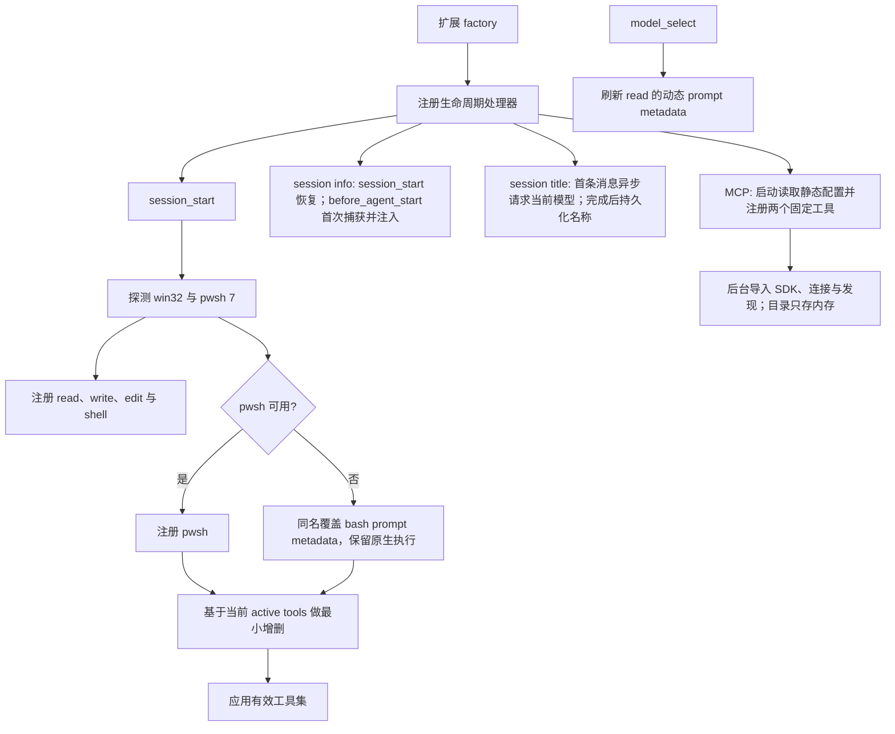

# 技术架构

## 交付形态

package 仅声明一个扩展入口：

```text
pi-enhanced/
├── extensions/
│   ├── pi-enhanced.ts       # 唯一公开、自动加载的扩展入口
│   └── lib/                 # 不被 pi 自动发现的内部实现
│       ├── activation.ts
│       ├── pwsh.ts
│       ├── edit.ts
│       ├── mcp-config.ts
│       ├── mcp-tools.ts
│       ├── mcp-hints.ts
│       ├── mcp.ts
│       ├── mcp-rendering.ts
│       ├── read.ts
│       ├── write.ts
│       ├── session-info.ts
│       ├── session-title.ts
│       └── settings.ts
├── tests/
├── docs/
├── package.json
└── tsconfig.json
```

“单入口”由 package manifest 保证；不要求把所有逻辑塞入一个物理文件。这样能保持发布表面极简，同时让每个高风险工具可独立测试。

## 启动与刷新流程



关键约束：

- 平台探测沿用 `pi-extensions` 的轻量策略：只在 `PATH` 与常见 PowerShell 7 安装位置查找 `pwsh.exe`，不为版本检查启动子进程。
- 探测结果可在扩展实例内缓存，session reload 时重新构造实例即可。
- `setActiveTools()` 以 `pi.getActiveTools()` 为基础做集合变换：删除本扩展明确接管的工具，保留未知工具。
- 注册同名 `edit` 覆盖执行；active tools 中仍使用名字 `edit`。
- 注册同名 `write` 覆盖执行；复用原生 definition 并只注入兼容 Bun/Windows `EEXIST` 的本地 operations。官方 pi 或 Bun 修复后删除该临时覆盖。
- `pwsh` 使用新名字，因此必须先注册，再把 `pwsh` 加入 active tools 并移除 `bash`。
- `read` 先注册后激活；它以同名 definition 覆盖原生工具，但复用原生 execute/render 能力。
- `read` 在 `session_start` / `model_select` 按当前模型的 image input 能力重新注册 prompt metadata：多模态路径描述为当前模型亲自查看图片，纯文本路径明确说明会委托外挂 vision 模型并返回其描述。
- session info 在第一轮 `before_agent_start` 才同时捕获时间与当前模型，并写入 `session-info` custom entry；后续轮次、模型切换和 session resume 始终复用固定 prompt。
- session title 只处理没有历史用户消息、没有现有名称的新会话。第一轮 `before_agent_start` 立即启动不阻塞主回答的当前模型请求。请求不设置模型输出 token 上限；prompt 要求中文与英文单词混排时保留一个空格，标题长度由 prompt 和返回后的 60 字符清洗共同约束，不对中英文边界做代码改写。完成后通过 `setSessionName()` 持久化，请求失败或纯图片首条消息静默保留 pi 默认名称。
- fork 不调用标题模型：若继承到名称，则把末尾 ` (n)` 递增，或首次追加 ` (1)`；未命名 fork 保留 pi 默认名称。
- `mcp-config.ts` 不依赖 SDK，在 `session_start` 读取本地配置；`mcp-tools.ts` 同步构造固定 search/call 与静态目录。SDK 仍后台导入并由 `mcp.ts` 管理连接，`tools/list_changed` 只更新内存目录。`mcp-hints.ts` 注册显式生成命令，进度/取消与配置写回独立于目录快照。`session_shutdown` 失效化尚未完成的导入并关闭 manager 与 transport。

## 复用边界

### 优先直接复用 pi

- shell：`createBashTool()` 或其 definition 对应构造器，保留输出聚合、50 KB / 2,000 行截断、timeout、取消、进程树终止和 TUI。
- edit：复用 pi 导出的队列、路径、diff 与原生 self-rendered call renderer；result renderer 先委托原生逻辑回填实际 diff，再追加部分成功的折叠/展开警告。若部分成功算法所需函数未导出，再复制带来源注释的最小纯函数。
- write：复用 `createWriteToolDefinition()` 的完整 contract，只注入本地 `mkdir` / `writeFile` operations；`EEXIST` 仅在 `stat` 确认父路径为目录后忽略。
- image：复用 pi 原生 read/image resize 路径或可导出的 image helpers，不重新实现图片格式解析。
- MCP：使用官方 TypeScript SDK 的 client、stdio transport 与 Streamable HTTP transport，不自行实现协议握手、分页、取消或 session transport。

### 允许本地实现

- PowerShell 7 探测与 prompt guidance。
- edit 的逐项分类、冲突消解和结果格式化。
- vision fallback 的模型选择、stream 状态归约和 UI renderer。
- vision 顶层配置合并与校验。
- 两层 MCP 配置读取、严格校验、覆盖合并、懒加载搜索/调用、hint 生成写回以及 MCP content 到 pi tool result 的适配。

## 工具激活协调器

入口统一注册增强工具，`activation.ts` 根据实际注册结果集中计算有效工具集：

1. 读取当前 active names。
2. 始终以增强 `edit` 接管 `edit` 名字（集合中名字不变）。
3. 始终加入同名覆盖后的 `read` 与 `write`。
4. 若 pwsh 可用，移除 `bash`、加入 `pwsh`；否则同名注册仅带通用 shell/ripgrep guidance 的 `bash` override、移除可能残留的 `pwsh` 并保留原先 `bash` 状态。
5. 去重后一次调用 `setActiveTools()`。

注意：“保留原先 `bash` 状态”意味着如果用户本来手动禁用了 bash，扩展不应擅自启用它。

## 并发与原子性

- `edit` 对同一绝对路径使用 `withFileMutationQueue()` 串行化完整的 read-classify-write 周期。
- `write` 继续使用原生 definition 内的 mutation queue；增强层不改变并发边界。
- accepted edits 基于同一个原始快照匹配，并在一次 write 中提交，避免逐项写盘导致后续匹配依赖前项。
- 同一调用中的重叠 edit 不可同时应用；冲突策略见工具契约。
- vision fallback 接受主调用的 `AbortSignal`，并在终止路径停止 timer 与 stream 订阅。
- session title 请求同时绑定当前 agent signal 与 session-scoped abort controller；session shutdown、reload 或切换时取消，异步结果写入前再次核对 session id 和当前名称，避免覆盖手工 `/name` 或串写新会话。
## MCP 生命周期与工具面

- manager 由当前 session 独占，配置按全局/可信项目 server 名覆盖合并，保留来源路径用于 hint 写回。连接并行且有 30 秒启动期限；调用只等待目标服务器，取消等待不影响共享连接。
- 模型工具集合固定为 `mcp_search` / `mcp_call`，基于现有 active set 增加，保留其他扩展工具。服务器名称/hint 快照按名称排序并写入 search description，不受连接状态或目录变化影响。
- `mcp_search` 负责名称/描述/参数名加权匹配、分页浏览和完整定义读取；schema 留在内存直到模型请求，不动态注册搜索结果。
- `mcp_call` 复用 Pi 的 raw JSON Schema 参数验证，再路由到最新目录对应的 SDK client；保留取消、图片、错误和文本总预算保护。
- 历史直接工具只注册非激活 renderer placeholder；新的固定工具同样使用折叠 renderer，session resume 仍可显示历史结果。
- `/mcp-gen-hints` 使用当前模型注册表的独立 complete 请求和可取消 loader，usage 单独记为 custom entry。只给缺失项生成；配置写回使用文件 mutation queue、重新读取与身份/hint 检查、同目录临时文件/rename，不修改内存快照。
- stdio stderr 管道持续消费，仅错误时展示有界尾部。MCP 文本共享 50 KB / 2,000 行预算，超限完整文本写系统临时文件，图片单独传递。搜索定义按条目分页，单个定义完整保留，不使用会截坏 JSON Schema 的文本裁剪。
- TUI 折叠最多 3 行/约 800 字符，Ctrl+O 展开保留经过模型侧保护后的原文。

## 兼容性原则

- 当前依赖与最低支持基线为 pi `0.87.0`。原生 read、write、shell wrapper 透传执行上下文；自定义 edit 同样优先使用调用时的 `ctx.cwd`，缺省时回退到构造器目录。
- 对 pi 的非公开实现复制必须记录上游文件与基线版本。
- 对公开构造器的返回 shape 做最小 wrapper，不假定未声明字段永久存在。
- 升级 pi 时重点回归：工具 details shape、renderer 继承、extension lifecycle、SettingsManager、nested usage 与 model stream event。
