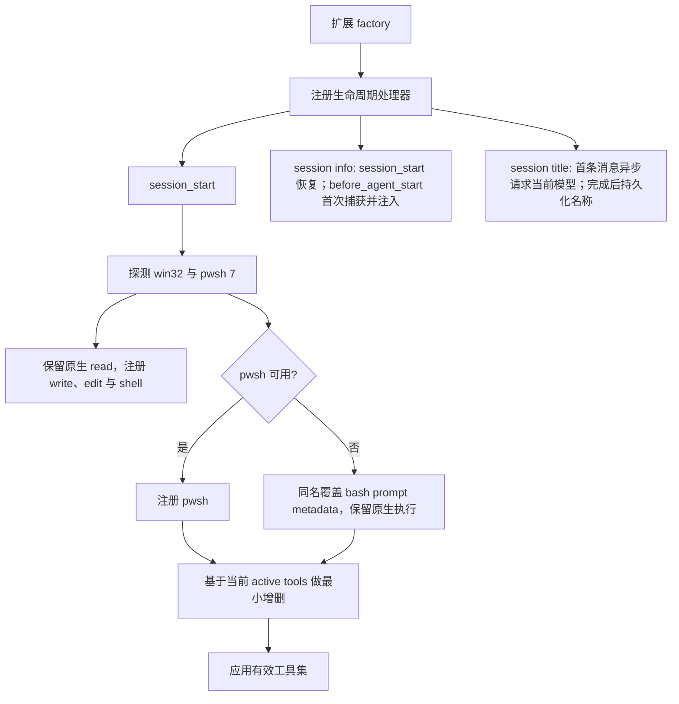

# 技术架构

## 交付形态

package 仅声明一个扩展入口：

```text
pi-enhanced/
├── extensions/
│   ├── pi-enhanced.ts       # 唯一公开、自动加载的扩展入口
│   └── lib/                 # 不被 pi 自动发现的内部实现
│       ├── activation.ts
│       ├── shell.ts
│       ├── edit.ts
│       ├── write.ts
│       ├── session-info.ts
│       └── session-title.ts
├── tests/
├── docs/
├── package.json
└── tsconfig.json
```

“单入口”由 package manifest 保证；不要求把所有逻辑塞入一个物理文件。这样能保持发布表面极简，同时让每个高风险工具可独立测试。

## 启动与刷新流程


```mermaid
flowchart TD
    A["扩展 factory"] --> B["注册生命周期处理器"]
    B --> C["session_start"]
    C --> D["探测 win32 与 pwsh 7"]
    D --> E["保留原生 read，注册 write、edit 与 shell"]
    D --> F{"pwsh 可用?"}
    F -->|是| G["注册 pwsh"]
    F -->|否| H["同名覆盖 bash prompt metadata，保留原生执行"]
    G --> I["基于当前 active tools 做最小增删"]
    H --> I
    I --> J["应用有效工具集"]
    B --> M["session info: session_start 恢复；before_agent_start 首次捕获并注入"]
    B --> N["session title: 首条消息异步请求当前模型；完成后持久化名称"]
```

关键约束：

- 平台探测沿用 `pi-extensions` 的轻量策略：只在 `PATH` 与常见 PowerShell 7 安装位置查找 `pwsh.exe`，不为版本检查启动子进程。
- 探测结果可在扩展实例内缓存，session reload 时重新构造实例即可。
- `setActiveTools()` 以 `pi.getActiveTools()` 为基础做集合变换：删除本扩展明确接管的工具，保留未知工具。
- 注册同名 `edit` 覆盖执行；active tools 中仍使用名字 `edit`。
- 注册同名 `write` 覆盖执行；复用原生 definition 并只注入兼容 Bun/Windows `EEXIST` 的本地 operations。官方 pi 或 Bun 修复后删除该临时覆盖。
- `pwsh` 使用新名字，因此必须先注册，再把 `pwsh` 加入 active tools 并移除 `bash`。
- `read` 直接使用 pi 原生工具，保留其现有 active 状态；本包不注册覆盖，也不在模型切换时刷新它。
- session info 在第一轮 `before_agent_start` 才同时捕获时间与当前模型，并写入 `session-info` custom entry；后续轮次、模型切换和 session resume 始终复用固定 prompt。
- session title 只处理没有历史用户消息、没有现有名称的新会话。第一轮 `before_agent_start` 立即启动不阻塞主回答的当前模型请求。请求不设置模型输出 token 上限；prompt 要求中文与英文单词混排时保留一个空格，标题长度由 prompt 和返回后的 60 字符清洗共同约束，不对中英文边界做代码改写。完成后通过 `setSessionName()` 持久化，请求失败或纯图片首条消息静默保留 pi 默认名称。
- fork 不调用标题模型：若继承到名称，则把末尾 ` (n)` 递增，或首次追加 ` (1)`；未命名 fork 保留 pi 默认名称。

## 复用边界

### 优先直接复用 pi

- shell：`createBashTool()` 或其 definition 对应构造器，保留输出聚合、50 KB / 2,000 行截断、timeout、取消、进程树终止和 TUI。
- edit：复用 pi 导出的队列、路径、diff 与原生 self-rendered call renderer；result renderer 先委托原生逻辑回填实际 diff，再追加部分成功的折叠/展开警告。若部分成功算法所需函数未导出，再复制带来源注释的最小纯函数。
- write：复用 `createWriteToolDefinition()` 的完整 contract，只注入本地 `mkdir` / `writeFile` operations；`EEXIST` 仅在 `stat` 确认父路径为目录后忽略。
- image：复用 pi 原生 read/image resize 路径或可导出的 image helpers，不重新实现图片格式解析。
- MCP：完全委托 pi 内置扩展，不维护连接与工具注册。

### 允许本地实现

- PowerShell 7 探测与 prompt guidance。
- edit 的逐项分类、冲突消解和结果格式化。

## 工具激活协调器

入口统一注册增强工具，`activation.ts` 根据实际注册结果集中计算有效工具集：

1. 读取当前 active names。
2. 始终以增强 `edit` 接管 `edit` 名字（集合中名字不变）。
3. 始终加入同名覆盖后的 `write`；`read` 的启用状态保持不变。
4. 若 pwsh 可用，移除 `bash`、加入 `pwsh`；否则同名注册仅带通用 shell/ripgrep guidance 的 `bash` override、移除可能残留的 `pwsh` 并保留原先 `bash` 状态。
5. 去重后一次调用 `setActiveTools()`。

注意：“保留原先 `bash` 状态”意味着如果用户本来手动禁用了 bash，扩展不应擅自启用它。

## 并发与原子性

- `edit` 对同一绝对路径使用 `withFileMutationQueue()` 串行化完整的 read-classify-write 周期。
- `write` 继续使用原生 definition 内的 mutation queue；增强层不改变并发边界。
- accepted edits 基于同一个原始快照匹配，并在一次 write 中提交，避免逐项写盘导致后续匹配依赖前项。
- 同一调用中的重叠 edit 不可同时应用；冲突策略见工具契约。
- session title 请求同时绑定当前 agent signal 与 session-scoped abort controller；session shutdown、reload 或切换时取消，异步结果写入前再次核对 session id 和当前名称，避免覆盖手工 `/name` 或串写新会话。
## 内置 MCP 协作

入口不读取 MCP 配置、不注册 MCP 工具或 renderer、不管理连接生命周期。激活协调器只变更自身工具，保留当前 active set 中的 MCP、codemode、tool_search 和其他扩展工具。

## 兼容性原则

- 当前依赖与最低支持基线为 pi `1.1.0`。原生 read 由 pi 管理，write、shell wrapper 透传执行上下文；自定义 edit 同样优先使用调用时的 `ctx.cwd`，缺省时回退到构造器目录。
- 对 pi 的非公开实现复制必须记录上游文件与基线版本。
- 对公开构造器的返回 shape 做最小 wrapper，不假定未声明字段永久存在。
- 升级 pi 时重点回归：工具 details shape、renderer 继承、extension lifecycle、原生 read 设置、标题请求 usage 与 model stream event。

- 原生 read 的结构化输出供 codemode 使用；本包不修改其结果，也不发起视觉模型调用。
- edit 的原生 renderer 接收 `outputPad`；部分成功警告遵循该缩进，继续复用原生实际 diff 回填与组件状态。
